# EnAET
Codes and all training records for paper: 
> [EnAET: Self-Trained Ensemble AutoEncoding Transformations forSemi-Supervised Learning](https://arxiv.org/abs/1911.09265)

## Introduction
Deep neural networks have been successfully applied to many real-world applications. However, these successes rely heavily on large amounts of labeled data, which is expensive to obtain. Recently, Auto-Encoding Transformation (AET) and MixMatch have been proposed and achieved state-of-the-art results for unsupervised and semi-supervised learning, respectively. In this study, we train an Ensemble of Auto-Encoding Transformations (EnAET) to learn from both labeled and unlabeled data based on the embedded representations by decoding both spatial and non-spatial transformations. This distinguishes EnAET from conventional semi-supervised methods that focus on improving prediction consistency and confidence by different models on both unlabeled and labeled examples. In contrast, we propose to explore the role of self-supervised representations in semi-supervised learning under a rich family of transformations. Experiment results on CIFAR-10, CIFAR-100, SVHN and STL10 demonstrate that the proposed EnAET outperforms the state-of-the-art semi-supervised methods by significant margins. In particular, we apply the proposed method to extremely challenging scenarios with only 10 images per class, and show that EnAET can achieve an error rate of 9.35% on CIFAR-10 and 16.92% on SVHN. In addition, EnAET achieves the best result when compared with fully supervised learning using all labeled data with the same network architecture. The performance on CIFAR-10, CIFAR-100 and SVHN with a smaller network is even more competitive than the state-of-the-art of supervised learning methods based on a larger network. We also set a new performance record with an error rate of 1.99% on CIFAR-10 and 4.52% on STL10. 

## Overall Framework
<p align="center">
  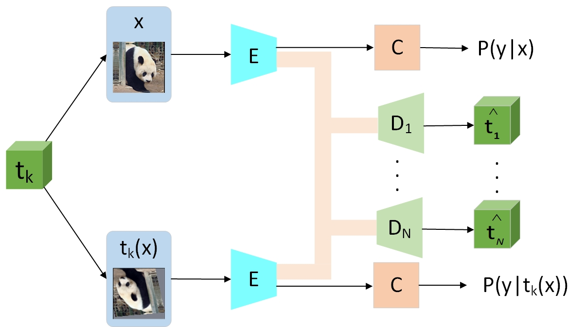
</p> 
The overall framework of EnAET.For each image x, we apply five different transformations: Projective,Affine,Similarity,Euclidean,CCBS(Color+Contrast+Brightness+Sharpness).   

The network is split into three parts: an representation encoder E, a classifier C, and a set of decoders D_k each for a type of transformation t_k. The original input x and all its transformed counterparts t_{k}(x) are fed through the network.  The original and transformed images have a Siamese encoder E and classifier C with shared weights.

## Algorithm
<p align="center">
  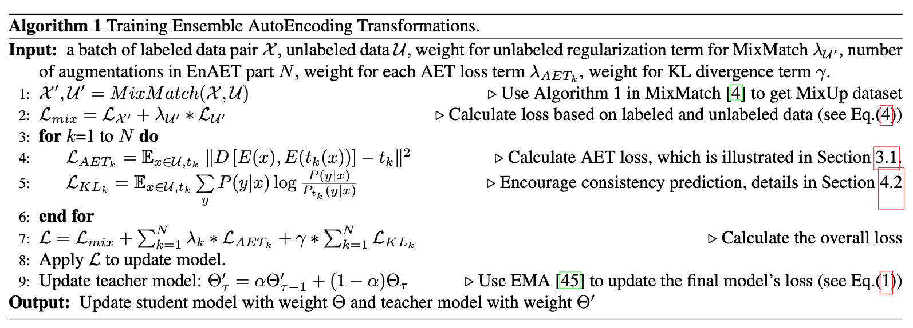
</p>

## Transformation Example
### Spatial Transformation
<p align="center">
  
</p>
The images are original, projective transformation,  affine transformation,  similarity transformation, euclidean transformation.

### Non-Spatial Transformation
<p align="center">
  
</p>
The  images  are  original,    color   transformation,    contrast   transformation,    brightness   transformation,   sharpen   transformation,   color+contrast,color+contrast+brightness, color+contrast+brightness+sharpen


## Environment SetUp
### For Beginer
In order to have a same environment to run my code, you have two options.

#### 1 Installing with pip3
```
pip3 install -r requirements.txt --user
```
I strongly suggest you do not use this way because it will possible violate your own python configurations and dependencies.

#### 2 Installing with anaconda
```
conda create -n EnAET python=3.6.7
conda activate EnAET
pip install -r requirements.txt 
```
Each time when you want to run my code, simply activate the environment by
```
conda activate EnAET
conda deactivate(If you want to exit) 
```
### For expert
In order to save time for you to download so many dependencies which may not be used in this project. I prepared a simple and clean dependecy list for expert. Please use pip or conda environment to run:
```
pip3 install -r min_requirements.txt --user
```

### Possible problems and solution
I always use git to manage my project. From my experience, sometimes the code can't work because of pytorch version and cuda version. When you see any errors during installment, usually it's pytorch version problem. Please come to [PyTorch](https://pytorch.org/) to download the suitable pytorch version for you.


## Running

### All command parameters Meaning
```
python3 main.py -h
```

### Running Command
#### CIFAR-10
```
python3 main.py --mode=0 -F=tmp_data/cifar --choose=0 --lr=0.002 --lr1=0.1 --batch_size=128 --num_workers=4 --type=0 --KL_Lambda=1.0 --lambda=10.0 --lambda1=7.5 --lambda2=5.0 --lambda3=2.0 --lambda4=0.5 --max_lambda=1 --max_lambda1=0.75 --max_lambda2=0.5 --max_lambda3=0.2 --max_lambda4=0.05 --portion=0.005 --beta=75 --mix_mode=1  --Mixmatch_warm=50 --dataset=cifar10
```
This is for running cifar-10 with 250 labels. When you want to test with different number of labeled data, simply change the --portion.           
Here I found an interesting thing is that you can only achieve around 91.7% accuracy if you used pytorch higher version. Personally, I suspect this decrease comes from the initialization of network. To solve this, simply update --Mixmatch_warm=200, you will also have the same performance as reported in the paper. For reference, I also keep the training records in the "Records" directory.
Simple instructions for all the parameters used here.
```
python3 main.py -h
--mode default:0, default mode to run
-F training data path(Automatically download to this path)
--choose use gpu id 
--lr default:0.002 learning rate for Adam optimizer for main backbone network
--lr1 default:0.1 learning rate for SGD optimizer for AET regularization network
--batch_size default:128 (Actually 256 is better, but one gpu can't support)
--num_workers default:16 number of data loading workers for pytorch dataloader
--type default:0 0:Wide ResNet-28-2, 1:Wide ResNet-28-2-Large
--KL_Lambda default:1.0 hyper parameter for KL divergence to control consistency in the framework
--lambda: warm factor for projective transformation AET regularization
--lambda1: warm factor for affine transformation AET regularization
--lambda2: warm factor for similarity transformation AET regularization
--lambda3: warm factor for euclidean transformation AET regularization
--lambda4: warm factor for CCBS transformation AET regularization
--max_lambda: hyper-parameter for projective transformation in AET regularization.
--max_lambda1: hyper-parameter for affine transformation in AET regularization.
--max_lambda2: hyper-parameter for similarity transformation in AET regularization.
--max_lambda3: hyper-parameter for eculidean transformation in AET regularization.
--max_lambda4: hyper-parameter for CCBS transformation in AET regularization.
--portion: specify the portion of data used as labeled data
--beta: hyper parameter for the consistency loss in MixMatch part
--mix_mode: default:1 specify to use Mosaic augmentation in MixMatch or not
--Mixmatch_warm: warm factor for MixMatch beta hyper parameter
--dataset: specify the dataset you will use for training
```
When you want to run with "Wide Resnet-28-2-Large", which requires 4 gpus:    
simply change two parameters: --type=1 --choose=0,1,2,3
```
python3 main.py --mode=0 -F=tmp_data/cifar --choose=0,1,2,3 --lr=0.002 --lr1=0.1 --batch_size=128 --num_workers=4 --type=1 --KL_Lambda=1.0 --lambda=10.0 --lambda1=7.5 --lambda2=5.0 --lambda3=2.0 --lambda4=0.5 --max_lambda=1 --max_lambda1=0.75 --max_lambda2=0.5 --max_lambda3=0.2 --max_lambda4=0.05 --portion=0.08 --beta=75 --mix_mode=1  --Mixmatch_warm=50 --dataset=cifar10
```
This is for running cifar-10 with 4,000 labels.

#### CIFAR100
Simply change --dataset --portion --beta(follow MixMatch setting)
```
python3 main.py --mode=0 -F=tmp_data/cifar --choose=0 --lr=0.002 --lr1=0.1 --batch_size=128 --num_workers=4 --type=0 --KL_Lambda=1.0 --lambda=10.0 --lambda1=7.5 --lambda2=5.0 --lambda3=2.0 --lambda4=0.5 --max_lambda=1 --max_lambda1=0.75 --max_lambda2=0.5 --max_lambda3=0.2 --max_lambda4=0.05 --portion=0.2 --beta=150 --mix_mode=1  --Mixmatch_warm=50 --dataset=cifar100
```
This is the command for running CIFAR100 with 10,000 labels.   
When you want to run with "Wide Resnet-28-2-Large", which requires 4 gpus:    
Simply change --type=1 --choose=0,1,2,3:
```
python3 main.py --mode=0 -F=tmp_data/cifar --choose=0,1,2,3 --lr=0.002 --lr1=0.1 --batch_size=128 --num_workers=4 --type=1 --KL_Lambda=1.0 --lambda=10.0 --lambda1=7.5 --lambda2=5.0 --lambda3=2.0 --lambda4=0.5 --max_lambda=1 --max_lambda1=0.75 --max_lambda2=0.5 --max_lambda3=0.2 --max_lambda4=0.05 --portion=0.2 --beta=150 --mix_mode=1  --Mixmatch_warm=50 --dataset=cifar100
```
This is the command for running CIFAR100 with 10,000 labels.

#### SVHN
Simply change --dataset --portion --beta(follow MixMatch setting) -F (change to a different saving path for data)
```
python3 main.py --mode=0 -F=tmp_data/SVHN --choose=0 --lr=0.002 --lr1=0.1 --batch_size=128 --num_workers=4 --type=0 --KL_Lambda=1.0 --lambda=10.0 --lambda1=7.5 --lambda2=5.0 --lambda3=2.0 --lambda4=0.5 --max_lambda=1 --max_lambda1=0.75 --max_lambda2=0.5 --max_lambda3=0.2 --max_lambda4=0.05 --portion=0.00342 --beta=250 --mix_mode=1  --Mixmatch_warm=50 --dataset=SVHN
```
This is the command for running SVHN with 250 labels.   
When you want to run with "Wide Resnet-28-2-Large", which requires 4 gpus:    
Simply change --type=1 --choose=0,1,2,3
``` 
python3 main.py --mode=0 -F=tmp_data/SVHN --choose=0,1,2,3 --lr=0.002 --lr1=0.1 --batch_size=128 --num_workers=4 --type=1 --KL_Lambda=1.0 --lambda=10.0 --lambda1=7.5 --lambda2=5.0 --lambda3=2.0 --lambda4=0.5 --max_lambda=1 --max_lambda1=0.75 --max_lambda2=0.5 --max_lambda3=0.2 --max_lambda4=0.05 --portion=0.01367 --beta=250 --mix_mode=1  --Mixmatch_warm=50 --dataset=SVHN
```
This is the command for running SVHN with 1,000 labels. 

#### STL10
Simply change --dataset --portion --beta(follow MixMatch setting) --choose -F (change to a different saving path for data)
```
python3 main.py --mode=0 -F=tmp_data/STL10  --choose=0,1,2,3,4,5,6,7 --lr=0.002 --lr1=0.1 --batch_size=128 --num_workers=4 --type=0 --KL_Lambda=1.0 --lambda=10.0 --lambda1=7.5 --lambda2=5.0 --lambda3=2.0 --lambda4=0.5 --max_lambda=1 --max_lambda1=0.75 --max_lambda2=0.5 --max_lambda3=0.2 --max_lambda4=0.05 --portion=0.2 --beta=50 --mix_mode=1  --Mixmatch_warm=500 --dataset=STL10
```
This is the command for running STL10 with 1,000 labels, which requires 8 gpus(2080Ti).

More training bash scripts which we used is saved in "scripts" dir. 
### Results and Visualization
All the training results will be kept in a subdirectory under "train_log" dirctory. "train.log" keeps the record of training accuracy, AET loss, MixMatch loss, KL loss, total loss and so on. "val.log" keeps the record of model's performance on all the training dataset. "test.log" keeps the record of model's performance on all the testing dataset. "trainlabel.log" keeps the record of student model's performance on testing dataset.   
All records for visualization will be kept in the "Tensorboard" directory of current subdirrectory. Simply run 
```
tensorboard --logdir=Tensorboard --port=9000 --bind_all
```
Then you can see the result in [server_ip]:9000 in browser.

### Training Records
We keep all the training records in "Records" directory. For someone want to reproduce our results, I believe it's a very good reference to make sure you are in the correct path.

### Resume your training
Compared to before, you should specify the -M=[model_path] --resume=1 --start_epoch=[previous_stop_epoch]     
For example(with cifar-100 10,000 labels):
```
python3 main.py --mode=0 -F=tmp_data/cifar --choose=0 --lr=0.002 --lr1=0.1 --batch_size=128 --num_workers=4 --type=0 --KL_Lambda=1.0 --lambda=10.0 --lambda1=7.5 --lambda2=5.0 --lambda3=2.0 --lambda4=0.5 --max_lambda=1 --max_lambda1=0.75 --max_lambda2=0.5 --max_lambda3=0.2 --max_lambda4=0.05 --portion=0.2 --beta=150 --mix_mode=1  --Mixmatch_warm=50 --dataset=cifar100 --resume=1 -M=[model_path] --start_epoch=292
```
Here I will save the checkpoint.pth.tar model under model sub dir of your current log directory (which described before). Please check train.log to make sure your resume step.

#### CIFAR-10 250 Labels
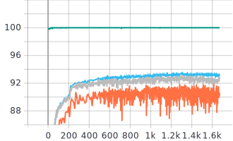
Green line is the training accuracy on trainset(250 labeled images), blue is the validation set(which is not actually used for validation, it's actually the whole unlabelled data+labeled data in training set), grey is the testing set performance, yellow is the student model's performance on testing set. More details related to loss please check in "Records" directory.

#### CIFAR-100 10000 Labels
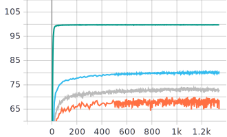

#### SVHN 100 Labels
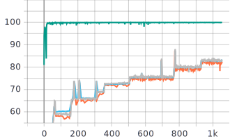
I choose this becuase it is very interesting to illustrate how transformation help the learning to become better step by step.

## Results
Here is our comparison with all previous SOTA methods.
<p align="center">
  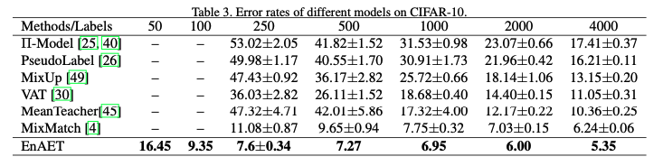
</p>
<p align="center">
  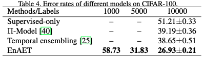
</p>
<p align="center">
  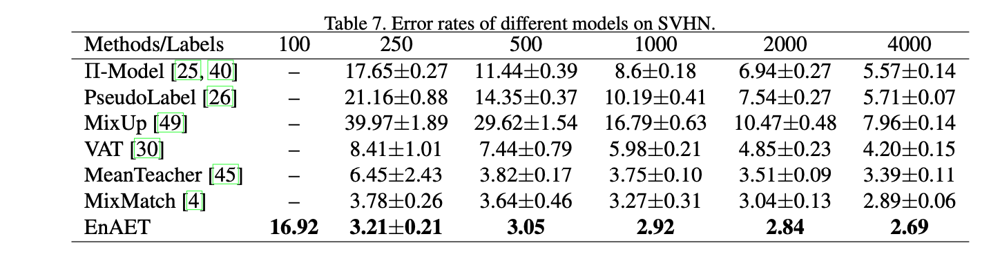
</p>
<p align="center">
  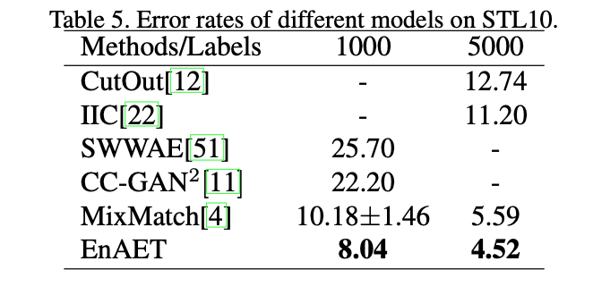
  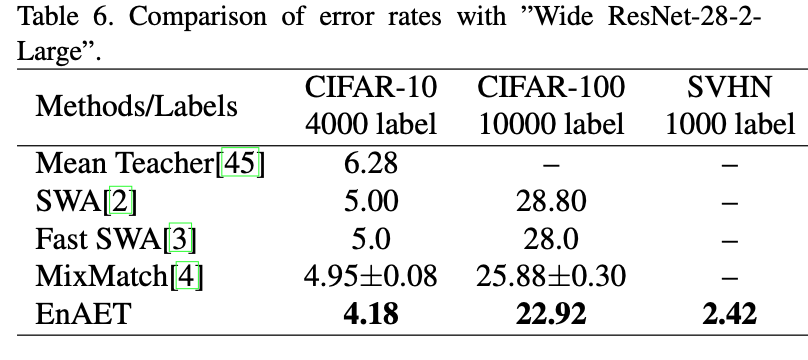
</p>

<p align="center">
  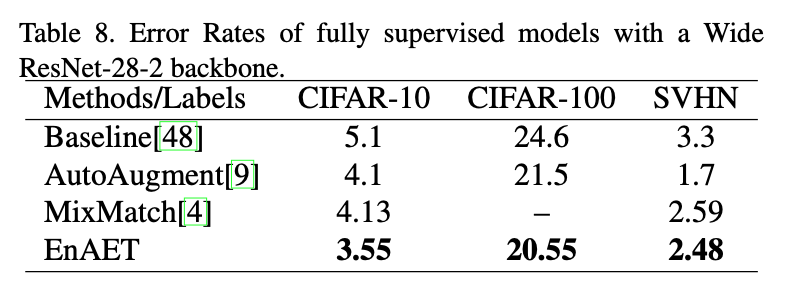
  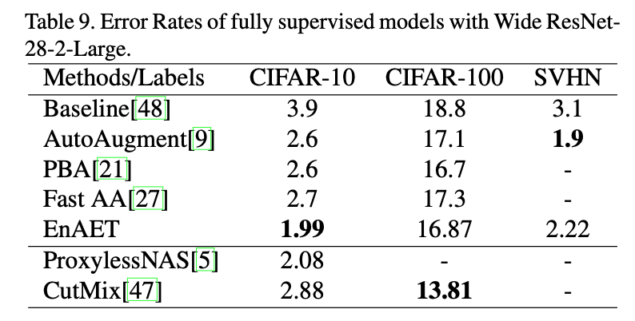
</p>

## Citation
If you use any part of this code in your research, please cite our [paper](https://arxiv.org/abs/1911.09265):   
```
@article{wang2019enaet,   
  title={EnAET: Self-Trained Ensemble AutoEncoding Transformations for Semi-Supervised Learning},   
  author={Wang, Xiao and Kihara, Daisuke and Luo, Jiebo and Qi, Guo-Jun},    
  journal={arXiv preprint arXiv:1911.09265},    
  year={2019}    
}   
```
